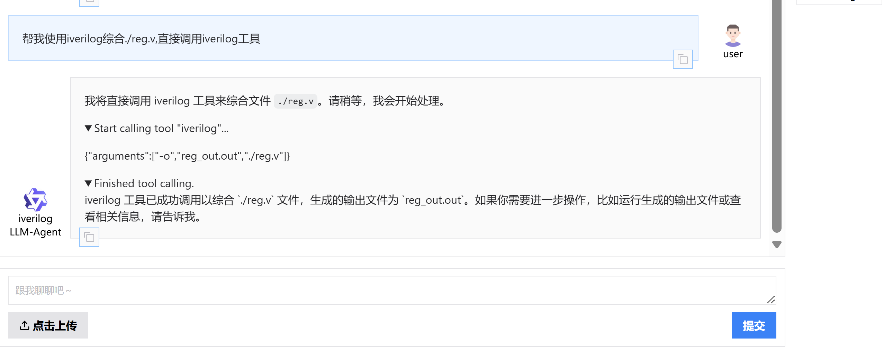

# advanced_pj_agent
advanced project 4 AI class
## A agent that can intelligently use eda tools (eg.iverilog)
    first install dependencies: pip install -U "qwen-agent[gui,rag,code_interpreter,python_executor]"
    then run: python agent.py
    open 127.0.0.1:7860 in browser and have fun!

